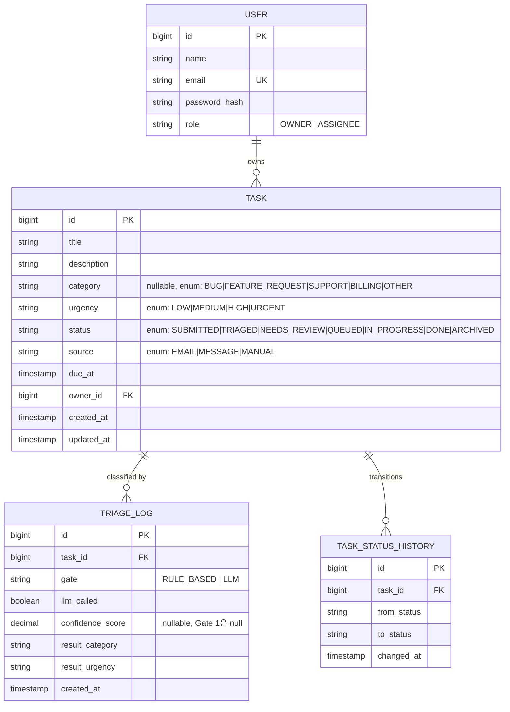

# ERD (확정)

관련 설계 결정: [0002-task-domain-model.md](./decisions/0002-task-domain-model.md)



`SLARule`은 다른 엔티티와 FK로 엮이지 않는 독립 설정 테이블이라 관계도에서 제외했다. `urgency`별 `response_time_hours`를 조회해 `Task.due_at`을 계산하는 데만 쓰인다.

```
SLA_RULE
 - id PK
 - urgency UK  (enum, 1행당 urgency 하나)
 - response_time_hours
```

## 연관관계 메모 (JPA 매핑 시 참고)

- `User 1 : N Task` → Task 쪽이 연관관계의 주인(owning side). `Task.owner_id`가 실제 FK 컬럼을 가지므로 `@ManyToOne`은 Task 엔티티에, `@OneToMany(mappedBy="owner")`는 필요하면 User 쪽에 선택적으로 추가한다. 처음엔 `@OneToMany`를 생략하고 Task 쪽 `@ManyToOne`만 두는 게 안전하다 — 무심코 `User` 하나 조회할 때 그 사람의 Task를 전부 끌고 오는 성능 문제(N+1, 대량 컬렉션 로딩)를 피할 수 있다.
- `Task 1 : N TriageLog` → 한 Task가 Gate 1 → Gate 2로 넘어가면서 로그가 여러 번 쌓일 수 있다 (재분류 이력 포함). `TriageLog` 쪽에 `@ManyToOne Task`.
- `Task 1 : N TaskStatusHistory` → 상태 전이마다 한 행씩 추가되는 append-only 로그. `TaskStatusHistory` 쪽에 `@ManyToOne Task`.
- 세 관계 모두 **단방향(Task → 없음, 자식 → 부모로 FK만)** 으로 시작하고, 정말 "이 User의 Task 목록"을 자주 조회해야 하는 화면이 생기면 그때 양방향으로 넓힌다. 처음부터 양방향으로 열어두면 순환 참조·직렬화 문제(JSON 무한 루프 등)를 마주치기 쉽다.

## 상태 머신 (Task.status)

```
SUBMITTED → (Gate 1/2 분류 완료, confidence 충분) → QUEUED → IN_PROGRESS → DONE → ARCHIVED
SUBMITTED → (Gate 2 confidence 부족) → NEEDS_REVIEW → (사람이 확인) → QUEUED → ...
```

`TRIAGED`는 "분류는 끝났지만 아직 큐에 안 들어간" 중간 상태로 둘지, 아니면 분류 완료와 동시에 바로 QUEUED로 넘어가고 `TRIAGED`는 로그성 개념으로만 남길지는 2주차 상태 머신 구현 시점에 정한다.
